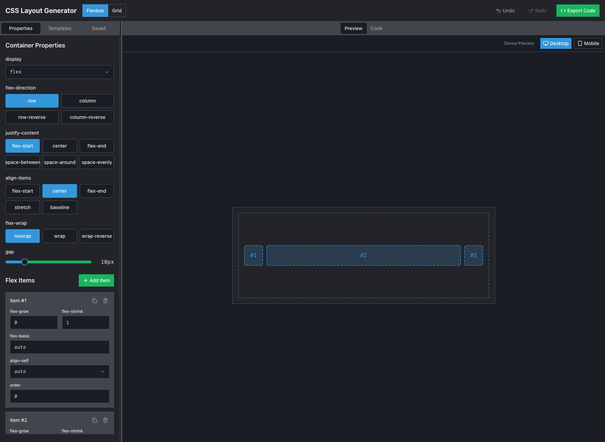

# FlexGrid Studio 🎨

A modern, interactive web application for generating and visualizing CSS layouts using Flexbox and Grid. Built with React, TypeScript, and Tailwind CSS.


[preview live Demo](https://flexgridstudio.netlify.app/)

## Features ✨

- **Interactive Layout Generation**: Create and visualize CSS layouts in real-time
- **Dual Layout Systems**: Support for both Flexbox and Grid layouts
- **Responsive Preview**: View your layouts in different screen sizes
- **Code Export**: Export your layouts as clean, production-ready CSS code
- **Undo/Redo**: History tracking for all layout changes
- **Modern UI**: Clean, intuitive interface built with Tailwind CSS
- **Real-time Preview**: See changes instantly as you modify properties

## Tech Stack 🛠️

- **Frontend**: React 18, TypeScript
- **Styling**: Tailwind CSS
- **State Management**: React Context
- **Routing**: Wouter
- **UI Components**: Radix UI
- **Build Tool**: Vite
- **Animation**: Framer Motion

## Getting Started 🚀

1. **Clone the repository**

   ```bash
   git clone https://github.com/daveyhert/flexgrid-studio.git
   cd flexgrid-studio
   ```

2. **Install dependencies**

   ```bash
   npm install
   ```

3. **Start the development server**

   ```bash
   npm run dev
   ```

4. **Open your browser**
   Visit `http://localhost:5173` to see the application in action.

## Usage Guide 📖

### Creating a Layout

1. Choose between Flexbox or Grid layout using the toggle in the header
2. Use the control panel to adjust layout properties
3. Add or remove items to your layout
4. Preview your layout in different screen sizes
5. Export your CSS code when ready

### Layout Properties

#### Flexbox

- Display
- Flex Direction
- Justify Content
- Align Items
- Flex Wrap
- Gap

#### Grid

- Grid Template Columns
- Grid Template Rows
- Gap
- Justify Items
- Align Items

## Contributing 🤝

Contributions are welcome! Please feel free to submit a Pull Request.

1. Fork the repository
2. Create your feature branch (`git checkout -b feature/amazing-feature`)
3. Commit your changes (`git commit -m 'Add some amazing feature'`)
4. Push to the branch (`git push origin feature/amazing-feature`)
5. Open a Pull Request

## License 📄

This project is licensed under the MIT License - see the [LICENSE](LICENSE) file for details.

## Acknowledgments 🙏

- [Radix UI](https://www.radix-ui.com/) for accessible UI components
- [Tailwind CSS](https://tailwindcss.com/) for utility-first CSS
- [Framer Motion](https://www.framer.com/motion/) for smooth animations
- [Wouter](https://github.com/molefrog/wouter) for lightweight routing

## Support 💖

If you find this project helpful, please consider giving it a ⭐️ on GitHub!

## Contact 📧

For any questions, suggestions, feel free to reach out:

- GitHub: [@daveyhert](https://github.com/daveyhert)
- Twitter: [@daveyhert](https://x.com/daveyhert)
- LinkedIn: [Davey Hert](https://www.linkedin.com/in/daveyhert/)
